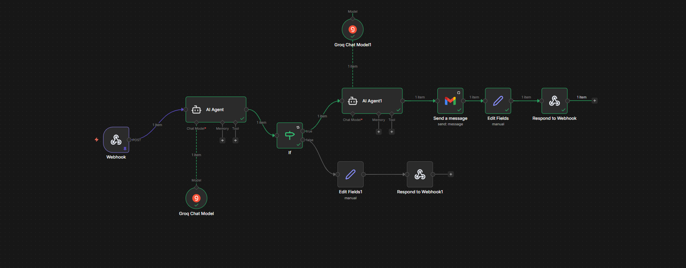

# 🧾 AI-Powered Customer Complaint Analyzer

An end-to-end AI automation system that converts unstructured customer complaint document into structured insights and automatically triggers escalation workflows.

The application uses Generative AI and workflow automation to analyze complaint documents, identify risk levels, and notify managers instantly—eliminating manual complaint triage.

This project demonstrates how AI + Business Process Automation (BPA) can transform traditional support workflows into fully automated decision pipelines.


## 🎯 Business Problem:
  
Organizations receive customer complaints in unstructured formats such as:

PDFs 
Emails
Web form submissions
Scanned documents

Handling these complaints typically requires manual review by support staff.

Traditional Complaint Handling Workflow
Support staff reads each complaint.
They interpret the issue manually.
They categorize the complaint.
They assess urgency.
They escalate critical cases to managers.
They manually draft escalation emails.
Operational Challenges
Problem	Impact
Manual complaint reading high operational effort
Inconsistent categorization poor data standardization
Delayed escalation	Slower issue resolution
Human dependency limited scalability
Unstructured complaint data hard to analyze trends

For organizations processing hundreds of complaints, this results in slow response times and high operational cost.


## 💡 Solution

The AI-Powered Customer Complaint Analyzer automates the entire complaint triage process.

The system:

1️⃣ Extracts text from complaint PDFs

2️⃣ Uses a Large Language Model (LLM) to analyze the complaint

3️⃣ Converts unstructured text into structured JSON insights

4️⃣ Identifies complaint category, urgency, and risk level

5️⃣ Triggers automated escalation workflows

6️⃣ Drafts and sends AI-generated alert emails

All analysis and escalation happens within seconds without manual intervention.


## ⚙️ System Architecture
```
User Uploads Complaint
        │
        ▼
        
Streamlit Web Application
        │
        ▼
        
PDF Text Extraction (pdfplumber)
        │
        ▼
        
LLM Analysis (Groq - LLaMA 3.3)
        │
        ▼
        
Structured JSON Output
        │
        ▼
        
n8n Workflow Automation
        │
        ├── AI Complaint Analysis
        ├── Priority Decision Logic
        ├── Email Draft Generation
        └── Email Notification
        ▼
Manager Alert
```


## 🔄 n8n Automation Workflow

Below is the workflow used to orchestrate the automation process.

It receives complaint data from the Streamlit application, performs AI-driven analysis, evaluates escalation conditions, generates an email, and sends alerts automatically.

Workflow Logic

1️⃣ Webhook Trigger
Receives complaint data from the Streamlit application.

2️⃣ AI Agent — Complaint Analysis
Analyzes the structured complaint data and extracts insights.

3️⃣ IF Node — Priority Decision
Evaluates whether the complaint meets escalation criteria.

4️⃣ AI Agent — Email Draft Generator
Generates a professional escalation email.

5️⃣ Email Node
Sends the alert email to the manager.

6️⃣ Set Node
Formats the final response.

7️⃣ Respond to Webhook
Returns results back to the Streamlit UI.


Below is the workflow used to orchestrate the automation process.




## 🔍 Application Workflow

### Step 1 — Upload Complaint

Users upload one or more complaint PDFs through the Streamlit web interface.

The system extracts readable text using pdfplumber.

### Step 2 — AI Complaint Analysis

The extracted complaint text is sent to a Groq-hosted LLaMA 3.3 70B model.

The model returns structured data in JSON format:
```
{
 "Complaint Category": "",
 "Priority": "",
 "Short Summary": "",
 "Risk Level": ""
}
```

This converts unstructured text into structured business intelligence.

### Step 3 — Structured Complaint Dataset

All complaints are compiled into a structured dataset using Pandas.
```
Field	Description
Order ID	       Order reference
Customer Name	       Complaint owner
Issue Type	       Original issue
Complaint Category     AI classification
Priority	       High / Medium / Low
Risk Level	       Risk assessment
Summary	AI generated summary
```
Users can download the dataset as a CSV file for reporting or analytics.

### Step 4 — Automated Escalation

When the complaint priority is High, the system triggers an n8n workflow via webhook.

The workflow:

Validates the complaint
Drafts an escalation email
Sends an alert to the manager
Returns the final response to the application

### Step 5 — Final Outputs

The application displays four outputs returned by the workflow:

1️⃣ Structured complaint JSON

2️⃣ AI analytical response

3️⃣ Generated email body

4️⃣ Email send status (SENT / NOT SENT)


## 🧠 Tech Stack
```
Layer	                Technology
Frontend	        Streamlit
Backend	                Python
PDF Parsing	        pdfplumber
AI Model	        Groq API (LLaMA 3.3 70B)
Workflow Automation	n8n
Data Processing	        pandas
API Requests	        requests
Deployment	        Streamlit Cloud
📂 Project Structure

customer-complaint-analyzer
│
├── app.py
├── requirements.txt
├── README.md
│
└── images
    └── n8n_workflow.png
```
## 🚀 Deployment
```
Clone Repository
git clone https://github.com/Faisal-Ghub/customer-complaint-analyzer.git
cd customer-complaint-analyzer
Install Dependencies
pip install -r requirements.txt
Configure Secrets

Create a .streamlit/secrets.toml file:

GROQ_API_KEY = "your_groq_api_key"
N8N_WEBHOOK_URL = "your_n8n_webhook_url"
Run Application
streamlit run app.py
Deploy to Streamlit Cloud
Push repository to GitHub
Connect repo to Streamlit Cloud
Add secrets in the Streamlit dashboard
Application deploys automatically
```
## 📊 Business Impact
```
The automation significantly reduces manual effort and improves response time.

Traditional Process
Step	Avg Time
Read complaint	2 min
Understand issue	1 min
Categorize complaint	1 min
Draft escalation email	2 min

Total ≈ 6 minutes per complaint

Automated Process
Step	Time
Upload complaint	10 seconds
AI analysis	5 seconds
Workflow automation	3 seconds

Total ≈ 18 seconds

⏱ Time Saved

Manual processing time:

6 minutes = 360 seconds

Automated processing time:

18 seconds

Time saved per complaint

360 − 18 = 342 seconds

Processing is ~95% faster

📈 Example ROI

If a company handles 500 complaints per month:

Manual effort:

500 × 6 minutes
= 3000 minutes
= 50 hours

Automated effort:

500 × 18 seconds
= 150 minutes
= 2.5 hours
Monthly Time Saved

47.5 hours

Annual Time Saved

570 hours

Equivalent to ~14 weeks of full-time operational work eliminated.
```
## 🔐 Security

Security best practices implemented:

API keys stored using Streamlit Secrets
No credentials hardcoded in the codebase
.streamlit/secrets.toml excluded from version control
Secure deployment via Streamlit Cloud

## 👨‍💻 Author

Faisal Khan

Built as part of an AI and Data Science capstone project demonstrating:

Generative AI integration
Intelligent document processing
Business process automation
End-to-end AI application deployment

✅ This project demonstrates how AI agents combined with workflow automation platforms can transform manual operational processes into scalable intelligent systems.
